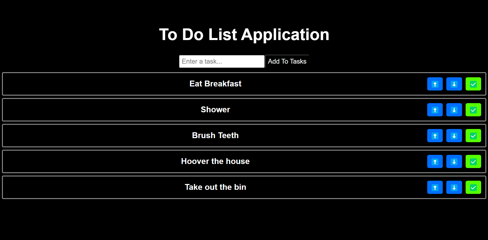

# ToDoListApp

I've created this application for personal use to be able to track my daily tasks, change the priority throughout the day and to be able to complete said task.

I have attached a screenshot of the working application.

To run you will need:

1) Download the zip folder
2) cd my-app
3) npm i
4) npm start

You will need to have Node.js installed on your computer as this installs React.js

To use application:

Youse the text field to write a task to do.
"Add Tasks" button to add the task below
Use the Arrow buttons to  move the task up or down in priority.
Use the tick box to complete your task and remove it from the list.

Have fun!
